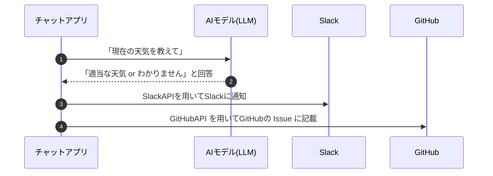
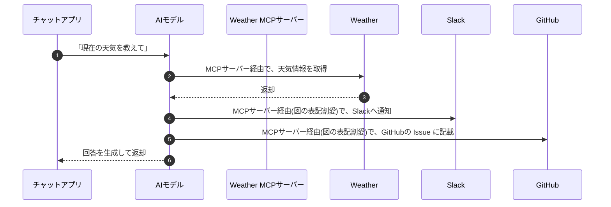

MCP について、

- 技術職ではないので詳細な技術的な話はよくわからないが、流行り・一般教養として概要を抑えたい。
- エンジニアだけど流行りに乗り遅れて MCP についてよく分かっていない。

そんな方に向けて、MCP についての概要を記載していきます。

::::message  
NOTE

- かなり噛み砕いた記載にしております。正しいニュアンスや詳細を知りたい方は、公式のドキュメントや、他の方の解説記事をご参照ください。
- 本記事では、以下のような言葉の定義として記載します。
  - 生成 AI アプリ：Claude や ChatGPT などの生成 AI アプリケーション
  - AI モデル：生成 AI アプリで内部的に使用される"学習モデル"

::::

 

## MCP とは

MCP とは、Model Context Protocol の略であり、[2024 年 11 月に Anthropic 社が発表](https://www.anthropic.com/news/model-context-protocol)しました。
Anthropic 社は、Claude という生成 AI アプリを開発している企業です。

[MCP についてのドキュメント](https://modelcontextprotocol.io/introduction#general-architecture)の和訳は以下です。

> MCP は、アプリケーションが LLM にコンテキストを提供する方法を標準化するオープンプロトコルです。
> MCP は AI アプリケーション用の USB-C ポートのようなものだと考えてください。
> USB-C がデバイスを様々な周辺機器やアクセサリに接続するための標準化された方法を提供するのと同様に、MCP は AI モデルを様々なデータソースやツールに接続するための標準化された方法を提供します。

簡単にまとめると、
MCP とは、「**AI モデルが外部データや外部ツールと通信する際の共通ルール**」です。

MCP の発表時には GoogleDrive、Slack、GitHub、Postgres などのメジャーなサービスの MCP サーバーが提供されており、現在では沢山のサービスの MCP サーバーが[公開されています](https://github.com/modelcontextprotocol/servers?tab=readme-ov-file)。

 

## "MCP" と "MCP サーバー" などの言葉の違い

MCP についての話になると、"MCP クライアント"、"MCP サーバー" などの言葉が出てきます。

「これらの言葉の指す意味は？」「違いはなに？」　と思うかもしれません。

これらの違いは、MCP を用いた一般的なアプリケーションのアーキテクチャについて、[公式ドキュメントに記載されている](https://modelcontextprotocol.io/introduction#general-architecture)名称です。

公式ドキュメントのアーキテクチャ図をベースに、まとめると以下のような関係性になります。

_MCP クライアントは MCP ホストを内包し、MCP を用いて MCP サーバーと通信します_

- **MCP**: AI モデルが外部データや外部ツールと通信する際の**共通ルール（プロトコル）**
- **MCP ホスト**: Claude, chatGPT などの**AI モデル**
- **MCP クライアント**:
  - Claude や ChatGPT などの**生成 AI アプリケーション**
  - VSCode や Cursur などの **IDE**
  - AI モデルを搭載した各種アプリケーション
- **MCP サーバー**:
  - MCP を用いて**外部サービスと連携するための中継機**。
  - **外部サービスと連携するための**[**便利な関数(Tools)を提供**](https://github.com/modelcontextprotocol/servers?tab=readme-ov-file#-reference-servers)してくれる軽量なプログラム。これらの Tools を通じて、AI モデルは外部サービスと連携することが可能に。

 

特に "**MCP サーバー**" という言葉は会話や記事の中でよく出てきます。
"サーバー"と名前がついてることより、"MCP"と言葉の指す意味は異なるのですが、
会話の流れや文脈的に、上記のアーキテクチャで組まれた MCP アプリ全体を総称して、「MCP」と呼ばれる場合もあることは注意が必要です。

 

## MCP についての簡単な例

「結局 MCP を用いると何ができる？」「従来の AI モデル搭載の アプリからどう変わる？」

まずは簡単なアプリ構成を例に見てみましょう。
巷でよくある chatGPT の AI モデル（純粋な LLM(大規模言語モデル)）を内蔵した、AI チャットアプリを考えてみましょう。

アプリの機能としては、「質問した内容と回答を、Slack に通知し 、Github の Issue に記載」とします。
このアプリに「現在の天気」を聞く場合の処理の流れは以下です。

1. 「現在の天気を教えて」と質問します。
2. 純粋な LLM では、リアルタイムの天気情報はモデルには含まれないので、恐らく「適当な回答 or わかりません」と返ってきます。
3. 質問と回答を、SlackAPI を用いて Slack に通知しします。
4. 質問と回答を、GitHubAPI を用いて Github の Issue に記載します。

アプリとしては AI モデルを使用するのは、テキストによる質問の回答を得るためだけです。
**他の外部サービスとの連携部分は自前で実装する必要があり**、AI に「アップロードしてください」とお願いしても対応してくれません。

 

これを MCP サーバー を用いて作ってみましょう。
MCP サーバーとしては、Slack、GitHub の MCP サーバーを設定します。
また、リアルタイムの天気情報も欲しいので、Weather の MCP サーバーも設定します。

以下、アプリの流れのイメージです。

※ 表示の関係上、MCP サーバー部分の表記は Weather だけとして、Slack と GitHub の MCP サーバーの表現は割愛しています。

1. 「現在の天気を教えて。そして回答内容を Slack と Github の Issue に記録して」と依頼します。
2. AI モデルは、質問の意図を理解し、リアルタイムの天気情報を得るためには、Weather MCP サーバーが提供する天気情報取得の Tool を利用する必要があると判断します。
   リアルタイムの天気情報はモデルに持たないので、MCP サーバー で適切な Tool がないかを確認します。
   Weather の MCP サーバーが設定されているので、Weather の MCP サーバーを選択して、天気情報を取得しにいきます。
3. AI モデル単体では外部サービスと連携するタスクは実行できないので、Slack の MCP サーバーを選択して、Slack に通知します。
4. 上記同様に、GitHub の MCP サーバーを選択して、GitHub の Issue に記載します。
5. 取得した天気情報を元に、質問に対する回答を生成し、処理が終了。

 

AI モデル自身が直接外部サービスと通信するのではなく、MCP サーバーを介することで、安全かつ効率的に外部サービスと連携が可能になります
また、外部サービスと連携できるだけでなく、以下のようなメリットもあります。

- アプリ側の実装部分も大幅に簡略化されます。
  - 上記の例で見ると、「チャットアプリ ↔ AI モデルとの連携」部分のみの実装だけで済み、アプリ側の実装部分が大幅に簡略化されます。
- 新しい外部サービスと連携したい場合、対応する MCP サーバーを設定するだけで済むため、追加・変更にも柔軟に対応できるようになります。

 

## MCP の概念図・イメージ図

MCP を立ち位置や、できることのイメージについての分かりやすい図については、他の方の記事をご覧いただければより理解が深まるかと思います。

ここまでの記載を見ていただいた後だと、各種の図のイメージが理解しやすいかと思います。

https://qiita.com/syukan3/items/f74b30240eaf31cb2686

https://www.adcal-inc.com/column/mcp/

※ 他にも分かりやすい図を載せていただいている記事がありますので、ぜひそちらもご参照ください。
[参照一覧](#参照)

 

## MCP サーバーを用いるメリット

上記でも一部記載しましたが、MCP サーバーを用いることで、以下のようなメリットがあります。

1. リアルタイム情報へのアクセス

   - 従来：学習モデルに依存するため、学習時点以降の最新情報にアクセスすることが困難。現在の天気など。
   - MCP：MCP サーバーを通じて、検索エンジンなどに接続できるため、最新の情報に基づいた応答が可能。

2. 外部ツールとの連携

   - 従来：学習モデルに沿った回答のみであり、外部サービスとの連携は不可。
   - MCP：MCP サーバーを通じて外部ツールを安全に呼び出すことができるため、AI アプリの機能が大幅に拡張され、より複雑なタスクを実行可能。

3. 特定のデータソースへの安全なアクセス

   - 従来：機密性の高い企業内データや個人のプライベートデータへの安全なアクセス制御が課題。
   - MCP：AI モデルが許可された範囲でのみ特定のデータソース（社内データベース、ファイルサーバーなど）に安全にアクセスが可能。

4. パーソナライズ

   - 従来：限られた入力情報に基づいて応答するため、ユーザーの状況や過去の履歴などの深いコンテキストを理解することが難しい場合があり。
   - MCP：Fetch などの MCP サーバーを通じて、ローカルファイルやユーザー固有のデータにアクセスできるため、よりパーソナライズされた、状況に応じた応答や提案が可能。

5. 柔軟な連携

   - 従来：特定の AI モデルやプラットフォームに強く依存し、異なるサービスや技術との連携が困難。
   - MCP：共通の通信ルール（プロトコル）であるため、柔軟な連携が容易。

6. 開発の効率化と再利用性
   - 従来：外部ツールとの連携機能を、個々のアプリ毎に実装する必要があり、開発コストが増加し、再利用性も低い傾向。
   - MCP：連携部分は AI モデル側でよしなに実行してくれるので、アプリ側は「MCP サーバーを設定するだけ」で済み、開発の効率化と再利用性の向上に貢献。

 

## MCP サーバーを用いた業務の効率化

MCP の全体像がある程度把握いただけたところで、"AI ツールの 1 ユーザー"として、MCP の恩恵を身近に活かせる方法を考えてみましょう。

特に、最近は生成 AI アプリが業務に無くてはならないツールとなってきています。
MCP のような新しい技術を取り入れることで、さらなる業務の効率化や生産性向上に繋がる可能性があります。

エンジニアでも非技術職であっても、
Claude や ChatGPT、Gemini などの生成 AI アプリを使用されている方は多いと思います。

これら当初は、テキストのやり取りだけの純粋な LLM でしたが、最近ではデフォルトで Web 検索や画像認識などの機能が搭載さるようになっています。
そこから更に、MCP サーバーを設定することで、外部サービスとも柔軟に連携できるようになります。
(※ 主要な生成 AI ツールでは、MCP の開発元である Claude のみが現在 MCP サーバーに対応してますが、すぐに他の生成 AI アプリも設定可能になると思います。)

上記のアプリ例をあげると、Slack 連携や Github 連携がいい例です。
MCP サーバーの設定をすることで、AI モデルがプロンプトの意図を理解し、適切な MCP サーバーと、そのサーバーが提供する Tool（関数）を選択・実行してくれるイメージです。

 

エンジニアであれば、業務に必須となるエディタ（IDE）に MCP サーバーを設定することで、業務の効率化が図れます。
最近では VSCode や Cursur などで、Copilot や Agent 機能を使用しての実装がマストとなってきているかと思います。
ここから更に MCP サーバーを設定することで、Copilot や Agent 機能がより柔軟に機能向上することも期待できます。

例えば、MCP サーバーを設定することで、
Copilot がプロジェクトの特定の設定ファイルやドキュメントをリアルタイムに参照して、よりコンテキストに合ったコード補完や提案を行ったり、
Agent 機能が外部の API ドキュメントを MCP サーバー経由で取得し、利用方法を提案したりすることが期待できます。

 

## まとめ

生成 AI 関連の技術は日々進化し、気づいたらもう新しい技術が登場しているような時代です。
今後数ヶ月で MCP に関する技術も更に発展していくことでしょう。

今後もできるだけ新しい技術にはついていって、業務に活かしていきたい思いです。

## 参照

:::details 【参照記事一覧】

- [Introducing the Model Context Protocol](https://www.anthropic.com/news/model-context-protocol)
- [Model Context Protocol（MCP）とは？生成 AI の可能性を広げる新しい標準](https://zenn.dev/cloud_ace/articles/model-context-protocol)
- [MCP とは？初心者向けにやさしく解説！AI ツール連携の新しい仕組み](https://www.adcal-inc.com/column/mcp/)
- [【徹底解説】MCP とは？「AI の USB ポート」](https://qiita.com/syukan3/items/f74b30240eaf31cb2686)
- [AI エージェント時代を変える「MCP」とは？その可能性と活用法](https://note.com/gabc/n/n9d3b8e852d34)

:::
